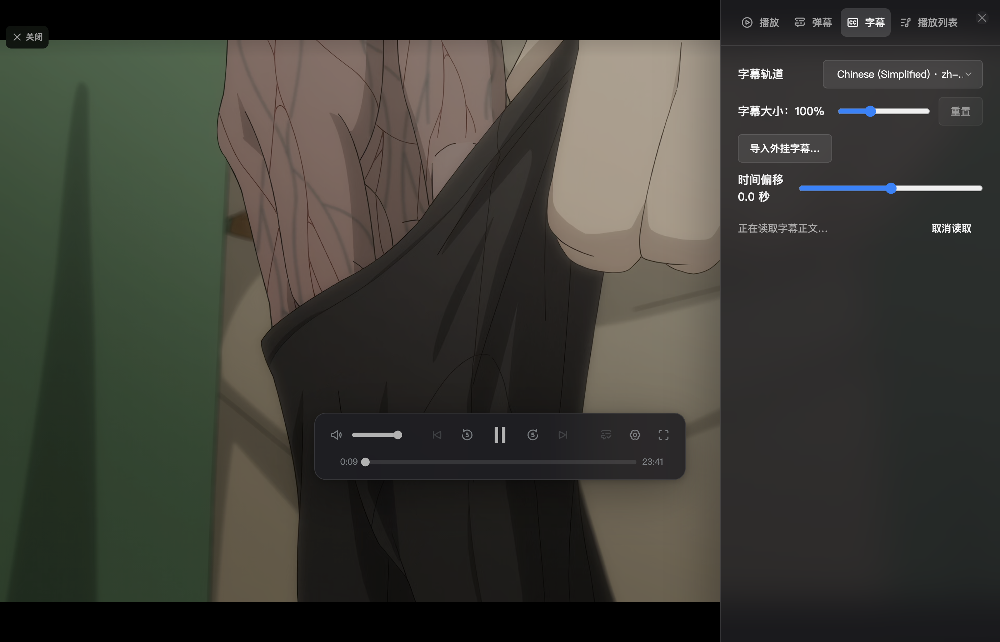
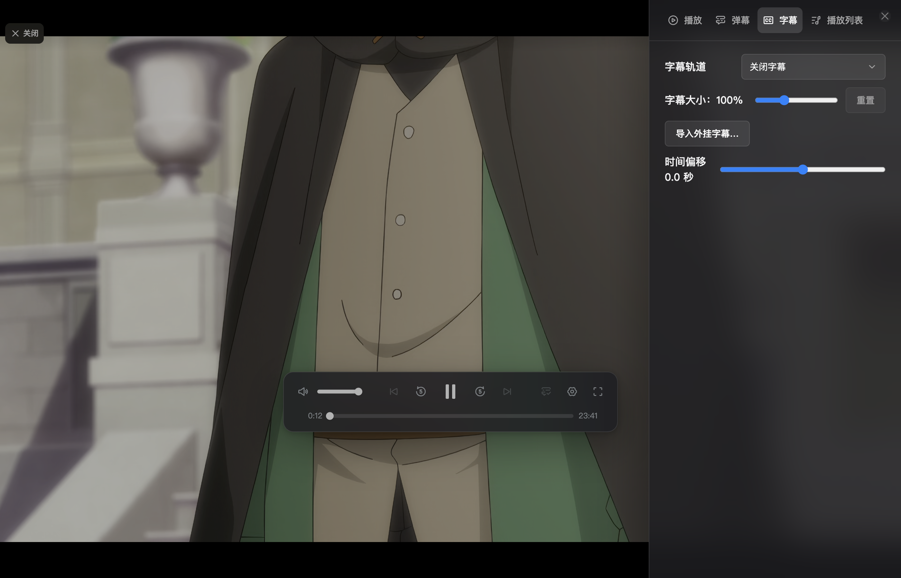
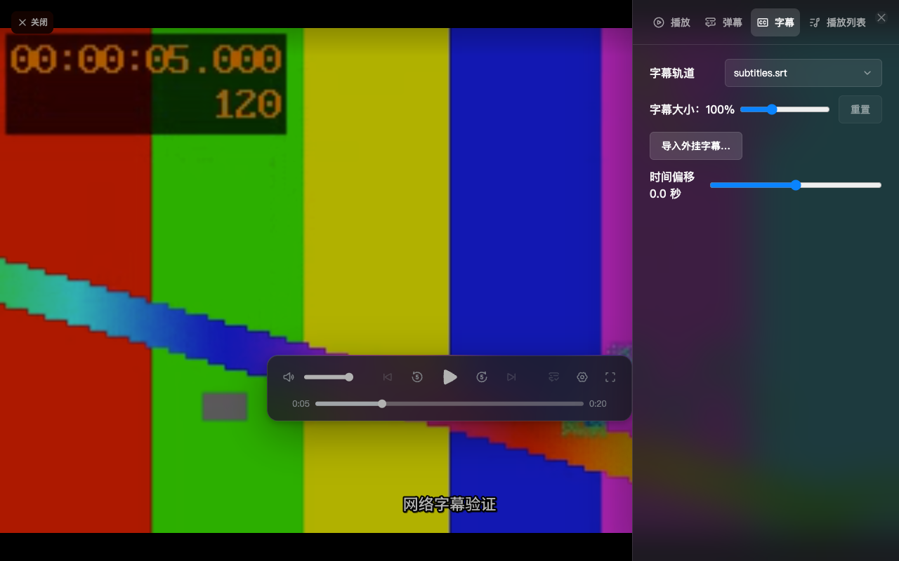

# 远程字幕与兼容内核预读修复

日期：2026-09-27。承接真实来源反馈，不替换首轮已签核记录；本轮尚未人工验收。

## 改动

- 远程 MKV 字体读取只查询开头元数据和 SeekHead 的 Attachments 位置，不逐个遍历媒体 Cluster。附件预算仍为 32 MiB，8 秒超时后使用默认字体。本地文件保留原有路径。
- 字幕轨道目录返回后即可操作；正文读取期间允许换轨、取消读取和导入外挂字幕。目录取消后可以重新读取。用户操作代次阻止旧请求覆盖选择；外挂导入复用已经解析的结果。
- 字幕目录、正文、字体分阶段记录读取次数、字节数及耗时，仅保留最近 32 条内存数据，不记录 URL 或字幕内容。
- 兼容内核及元数据 owner 的远程 CustomSource 从无预读改为 network 预读，缓存仍限制为 32 MiB；本地来源不变。关闭来源时取消后台读取。

## Electron 真实来源验证

使用用户提供的远程 4K HEVC MKV，通过独立 Electron 开发实例验证；弹幕匹配使用受控未匹配响应，视频和字幕数据实际请求远端。完整签名 URL 不纳入证据。

- 识别 24 条字幕轨道；目录阶段一次逻辑读取约 1 MiB，约 751 ms。该耗时不包含媒体资源建立。
- 内嵌字幕正文约 21 秒完成 69 次逻辑读取、约 1.37 MB，采样结束时仍在加载。
- 字体阶段 6 次逻辑读取、490640 字节，到 8 秒期限回退默认字体。诊断 completed 表示函数返回，包含字体降级，不能理解为字体已下载成功。
- 加载期间下拉框、外挂字幕导入可用；选择繁体轨道后取消，随后 3/6/9 秒检查均保持关闭字幕，没有迟到选择回写。
- 逻辑读取次数是 SubtitleSource.read 次数，不等同于实际 HTTP 请求数量。

## 外挂字幕交互验证

Web Chrome 使用受控 HTTP Range MKV（每次请求延迟 600 ms），在内嵌字幕读取过程中经真实文件选择器导入 SRT。轨道切换为 subtitles.srt，5 秒画面显示“网络字幕验证”；再等待 9 秒，旧内嵌读取没有覆盖新选择。

该项验证受控来源，不代表用户真实远程来源已通过 Web 跨域验证。直接在 Web 打开真实来源的尝试未到达直接播放步骤，尚未定位，因此不计为通过。

## 兼容内核与 H5

当前 MediaBunny CustomSource 默认没有预读；远程来源逐次等待数据容易放大网络往返延迟。开启有预算的网络预读后，同一条真实 MKV 采样结果如下（每种内核 12 次、每次间隔约 1 秒）：

| 内核 | 采样首尾时钟增量 | 解码帧率中位数 | buffering 样本数 |
| --- | --- | --- | --- |
| 原生 H5 | 11.04 秒 | 23.9 fps | 0 |
| 兼容 WebCodecs | 11.05 秒 | 24.0 fps | 0 |

原始快照见 [H5](native-after.json)、[兼容内核](compat-after.json)。此次兼容内核实际后端为 WebCodecs，不是 HEVC WASM。兼容视频队列峰值为 1 帧、音频前瞻约 0.5 秒，仍比浏览器原生播放更容易受调度及网络波动影响。

改动前一次兼容切换曾出现 15 秒媒体解码响应超时，但前后播放位置和缓存状态不同，不作为严格性能提升倍数的依据。以上仅是短时运行证据，不代表长片、弱网和所有设备均流畅。

## 检查

- 播放运行时：41 文件、199 测试通过。
- 类型检查、Electron 构建、Web 构建通过。
- 定向 lint 无错误；保留一条 React Fast Refresh 导出警告。
- 新增测试覆盖字体索引跳转、无索引不全片扫描、超时回退与取消、远程 owner 有限预读及关闭取消。

## 剩余边界

整条字幕正文仍需读取完成后交给 libass，本轮未实现按播放时间分段加载。此真实来源的正文依然可能等待较久；本轮已消除字体全片遍历并提供取消、换轨及外挂导入，不宣称解决所有字幕等待问题。完整正文成功显示、长时间弱网播放和更多平台需继续验证。
