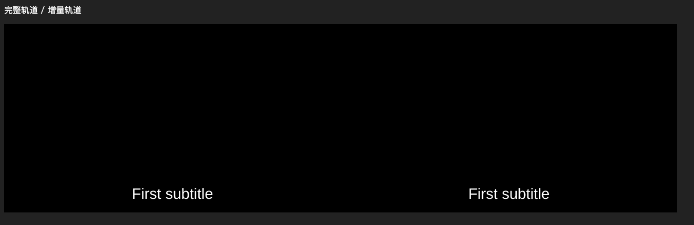
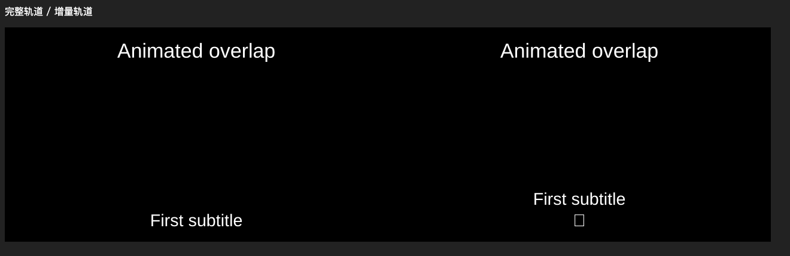
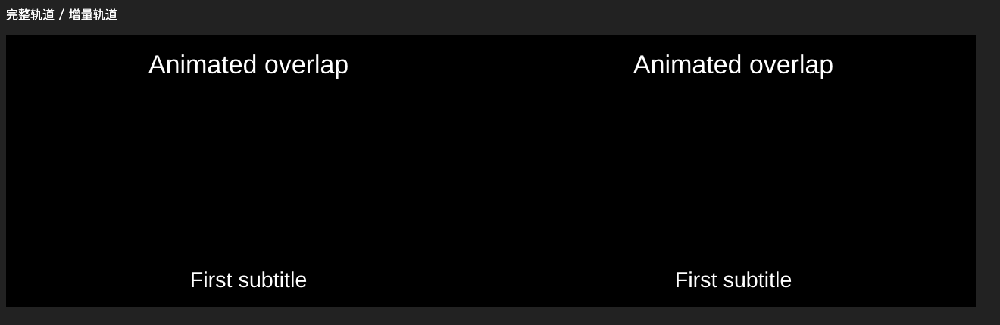

# 增量字幕接口门槛：未通过

日期：2026-09-27。基线 HEAD 为 bc32272，main 分支有已有 HTTP 直链/字幕恢复、SEO 和技能等未提交工作，均保留。未修改生产字幕或播放器代码。

## 基线

当前索引路径先收集整轨事件，外层再次等待完整正文及字体。受控本地 20 秒 MKV 加每次逻辑 read 15 ms 延迟：目录约 17 ms、首条事件约 82 ms，共 5 次逻辑读取、1116225 字节、1 条字幕，见 baseline.json。该短文件用于确认读取路径，不能代表长片性能；逻辑读取不是实测 HTTP 请求。

此前真实 MKV 的 21 秒/69 次读取测量属于上一变更的历史证据，此次未重复请求真实签名 URL。此次重点是先验证新增渲染契约，尚未进行生产性能优化。

## 可复现实验

命令：`node scripts/player-engine/tests/subtitle-incremental-gate.mjs`。

依赖为当前锁定的 @jellyfin/libass-wasm 4.2.4，使用独立本地静态服务器、实际 Chrome headless 和实际 libass WASM Worker。左侧是完整轨道，右侧为空轨道开始并追加相同事件；字体、尺寸和采样时间一致。无私有 Worker 消息、依赖修改或模拟渲染。每阶段通过公开 getEvents 等待前序操作完成，再请求时间并比较 Canvas RGBA。

测试脚本在门槛失败时退出码为 1，所有浏览器与服务在 finally 中关闭。这是发现实现阻塞的实验，不是产品验收轮次。

## 结果

| 操作 | 结果 |
| --- | --- |
| 2 秒追加当前字幕 | 两侧像素一致 |
| 3.5 秒重叠与字号动画 | 两侧像素一致 |
| 13 秒追加后续字幕 | 两侧像素一致 |
| removeEvent(0) 后到 2.5 秒 | 该事件应不显示，但增量侧仍有 3035 个非透明像素；getEvents 仍返回原位置事件 |
| 重新追加同一业务事件并回跳 3.5 秒 | 与完整轨道相差 14601 个 RGBA 通道值，出现额外文字/异常字形，画面不一致 |
| 显式 freeTrack + setTrack 重建 | 同一 3.5 秒恢复像素一致 |

两次独立浏览器运行复现相同差异，见 gate.json 和 repeat.json。删除后的事件读取还观察到 Name 字段异常；这不足以直接证明原生内存错误，不将其宣称为已定位的库内部根因。也不能用“事件计数没有缩小”单独判断失败；关键是删除后仍显示、回跳重加画面不一致。

## 结论和后续

当前直接使用事件追加/删除的路线未满足计划中的安全淘汰要求。已有增量追加通过少量采样，不等于完整 SSA/SRT、字号、字体迟到、长时间资源门槛通过。这些检查以及生产实现尚未完成，tasks 保持 2/26。

依照 design 的验证门槛与 marchen-apply 的设计问题暂停规则，暂停于任务 1.3，不接入第 2–6 组；未创建人工验收轮次或宣称验收通过。

下一步可修订设计后验证：

1. 固定数量事件槽位，使用公开 setEvent 更新并复用，避免 removeEvent；需要验证旧文本释放、索引/缓存失效、长期内存及正确性，当前尚未验证。
2. 有限时间窗口轨道重建；本实验只证明一次重建可恢复一致，仍须证明播放中切窗不闪烁、不打断动画、预算及重解析成本可接受。原设计允许明确窗口重建，但尚不足以把它直接替代已失败的淘汰机制。

不自行 fork libass 或增加私有消息补丁。应先明确采用哪种淘汰契约以及门槛，再恢复生产接入。
